# Markdown 语法示例大全

这是一个包含所有标准 Markdown 语法示例的文档。

## 目录

- [标题](#标题)
- [段落和换行](#段落和换行)
- [强调](#强调)
- [列表](#列表)
- [链接](#链接)
- [图片](#图片)
- [代码](#代码)
- [表格](#表格)
- [引用](#引用)
- [分割线](#分割线)
- [其他语法](#其他语法)
  - [Mermaid 图表](#mermaid-图表)

---

## 标题

# 一级标题 (H1)
## 二级标题 (H2)
### 三级标题 (H3)
#### 四级标题 (H4)
##### 五级标题 (H5)
###### 六级标题 (H6)

### 另一种标题语法

一级标题
========

二级标题
--------

---

## 段落和换行

这是一个段落。段落之间用空行分隔。

这是另一个段落。  
如果要在同一段落内换行，在行末添加两个空格。

你也可以用反斜杠换行\
像这样。

---

## 强调

### 斜体

*这是斜体文本*

_这也是斜体文本_

### 粗体

**这是粗体文本**

__这也是粗体文本__

### 粗斜体

***这是粗斜体文本***

___这也是粗斜体文本___

**_混合语法_**

---

## 列表

### 无序列表

- 项目 1
- 项目 2
- 项目 3
  - 嵌套项目 1
  - 嵌套项目 2
    - 更深层嵌套
- 项目 4

或者使用 `*` 或 `+`：

* 星号列表
* 另一项

+ 加号列表
+ 另一项

### 有序列表

1. 第一项
2. 第二项
3. 第三项
   1. 嵌套第一项
   2. 嵌套第二项
4. 第四项

### 任务列表

- [x] 已完成的任务
- [ ] 未完成的任务
- [x] 另一个已完成的任务
- [ ] 待办事项

---

## 链接

### 行内链接

[这是一个链接](https://www.example.com)

[带标题的链接](https://www.example.com "链接标题")

### 引用式链接

[引用式链接][link-ref]

[另一个引用][1]

[link-ref]: https://www.example.com
[1]: https://www.google.com

### 自动链接

<https://www.example.com>

<email@example.com>

### 相对链接

[相对路径链接](./README.md)

---

## 图片

### 行内图片


### 引用式图片

![Alt 文本][image-ref]

[image-ref]: https://via.placeholder.com/200

### 带链接的图片

[](https://www.example.com)

---

## 代码

### 行内代码

这是 `行内代码` 示例。

### 代码块

```
这是一个简单的代码块
可以包含多行
```

### 带语法高亮的代码块

```javascript
function greet(name) {
    console.log(`Hello, ${name}!`);
}

greet('World');
```

```python
def greet(name):
    print(f"Hello, {name}!")

greet("World")
```

```html
<!DOCTYPE html>
<html>
<head>
    <title>示例</title>
</head>
<body>
    <h1>Hello World</h1>
</body>
</html>
```

### 缩进代码块

    这是缩进代码块
    使用 4 个空格或 1 个制表符缩进

---

## 表格

### 基本表格

| 姓名 | 年龄 | 城市 |
|------|------|------|
| 张三 | 25   | 北京 |
| 李四 | 30   | 上海 |
| 王五 | 28   | 广州 |

### 对齐表格

| 左对齐 | 居中对齐 | 右对齐 |
|:-------|:--------:|-------:|
| 左     |    中    |     右 |
| 文本   |   文本   |   文本 |

### 复杂表格

| 功能 | 描述 | 状态 |
|------|------|------|
| **粗体** | *斜体* | `代码` |
| [链接](https://example.com) |  | ~~删除线~~ |

---

## 引用

### 简单引用

> 这是一个引用块。
> 可以包含多行内容。

### 嵌套引用

> 这是第一层引用
> 
> > 这是嵌套引用
> > 
> > > 更深层的嵌套

### 引用中的其他元素

> ## 引用中的标题
> 
> 1. 引用中的列表
> 2. 第二项
> 
> **粗体文本** 和 *斜体文本*
> 
> ```
> 引用中的代码块
> ```

---

## 分割线

可以使用以下任意一种方式创建分割线：

---

***

___

- - -

* * *

---

## 其他语法

### 删除线

~~这是删除线文本~~

### 下标和上标

H~2~O (下标)

X^2^ (上标)

### 高亮

==高亮文本==

### 脚注

这是一个脚注示例[^1]。

这是另一个脚注[^note]。

[^1]: 这是脚注内容。

[^note]: 
    这是一个更长的脚注。
    可以包含多个段落。
    
    甚至可以包含代码：
    
    ```
    function example() {
        return "脚注中的代码";
    }
    ```

### 缩写

*[HTML]: Hyper Text Markup Language
*[CSS]: Cascading Style Sheets

HTML 和 CSS 是 Web 开发的基础技术。

### 定义列表

Apple
:   水果
:   公司名

Orange
:   水果

### 键盘按键

按 <kbd>Ctrl</kbd> + <kbd>C</kbd> 复制文本。

### 数学公式 (如果支持)

行内公式：$E = mc^2$

块级公式：

$$
\int_{-\infty}^{\infty} e^{-x^2} dx = \sqrt{\pi}
$$

### Mermaid 图表

Mermaid 是一个基于文本的图表生成工具，支持多种图表类型。

#### 流程图

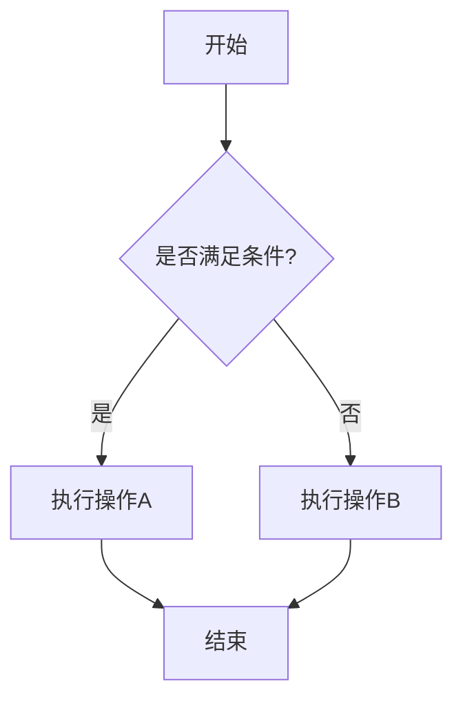

#### 序列图

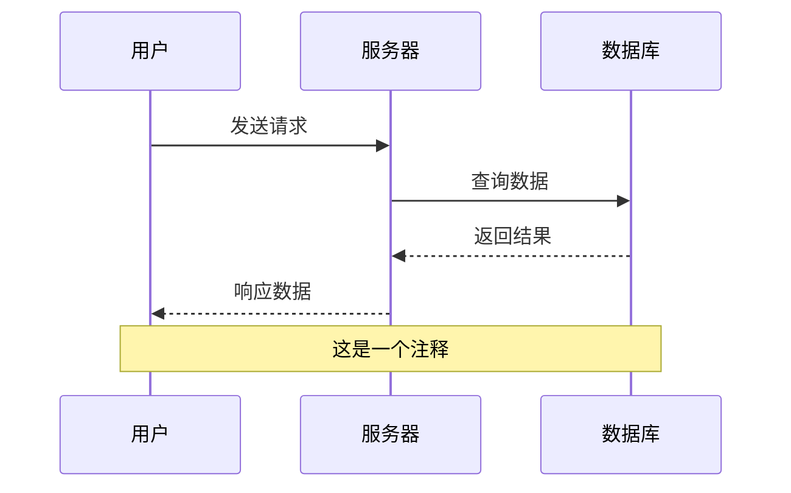

#### 甘特图

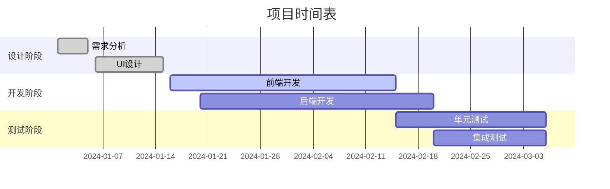

#### 饼图

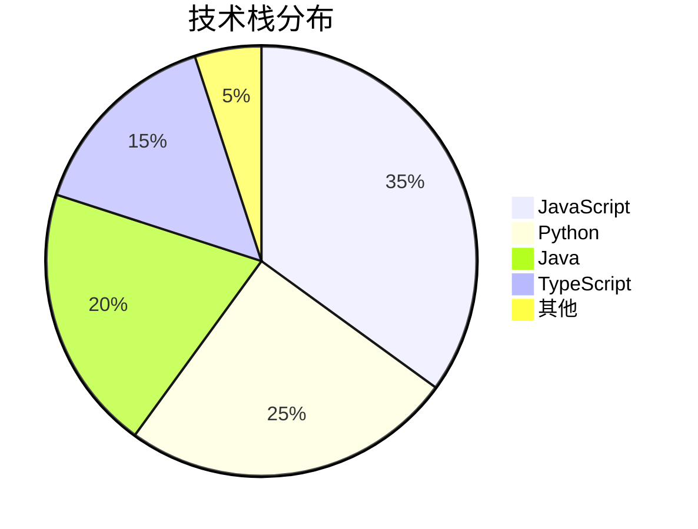

#### Git图

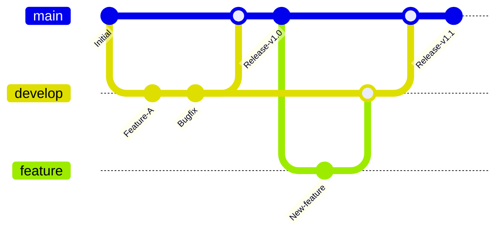

#### 用户旅程图

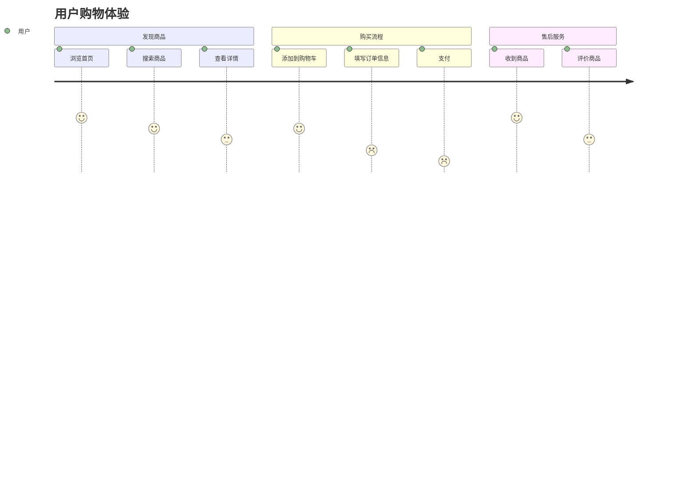

#### 状态图

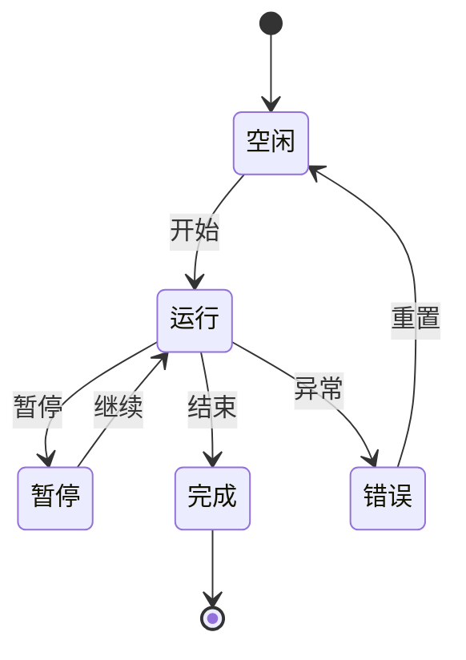

#### 类图

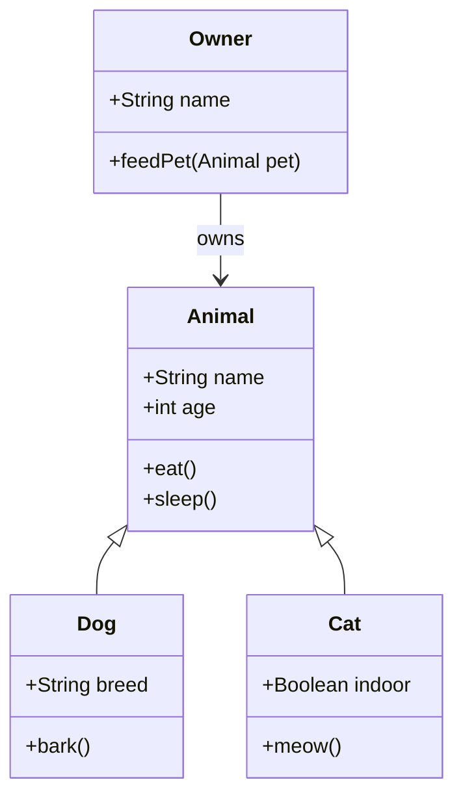

#### ER图 (实体关系图)

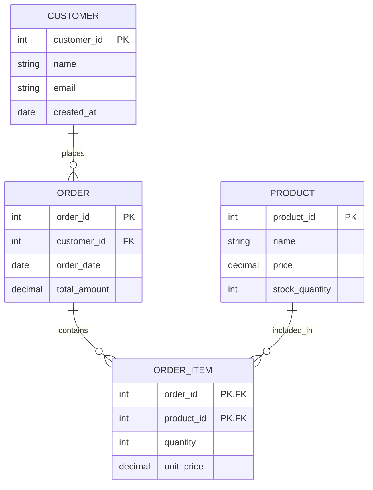

#### 思维导图

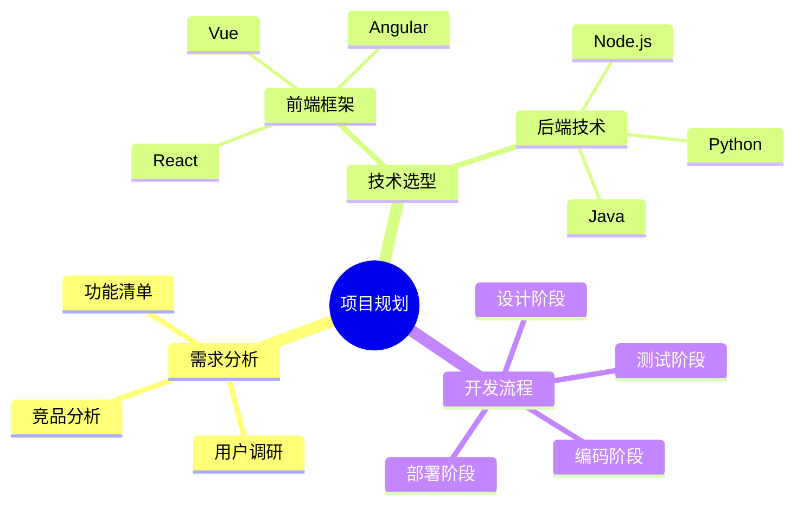

#### 时间线图

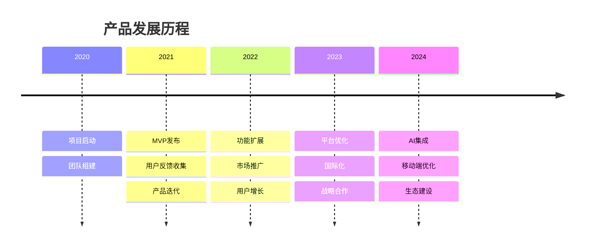

### HTML 标签

你可以在 Markdown 中使用 <mark>HTML 标签</mark>。

<details>
<summary>点击展开详情</summary>

这是隐藏的内容。

- 可以包含任何 Markdown 语法
- **粗体文本**
- `代码`

</details>

### 转义字符

使用反斜杠转义特殊字符：

\*这不是斜体\*

\[这不是链接\]

\`这不是代码\`

---

## 总结

以上就是 Markdown 的主要语法示例。不同的 Markdown 解析器可能支持不同的扩展语法，建议根据你使用的平台（如 GitHub、GitLab、Typora 等）查看相应的文档。

**常用语法速查：**

- `#` 标题
- `**粗体**` 或 `__粗体__`
- `*斜体*` 或 `_斜体_`
- `[链接](URL)`
- ``
- `` `代码` ``
- `> 引用`
- `- 列表项`
- `1. 有序列表`
- `| 表格 | 列 |`
- ` ```mermaid ` Mermaid图表

**Mermaid 图表类型：**
- `graph` 流程图
- `sequenceDiagram` 序列图
- `gantt` 甘特图
- `pie` 饼图
- `gitgraph` Git图
- `journey` 用户旅程图
- `stateDiagram` 状态图
- `classDiagram` 类图
- `erDiagram` 实体关系图
- `mindmap` 思维导图
- `timeline` 时间线图

---

*最后更新时间：[当前日期]* 